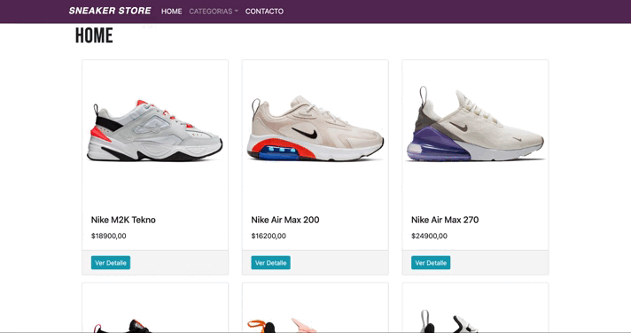

# PROYECTO DE ECOMMERCE: Sneaker Store

Este proyecto ha sido desarrollado como resultado del curso de ReactJS de Coderhouse (Agosto 2021).
Se trata de un ecommerce de zapatillas tipo sneakers con secciones por categoria, contacto y carrito de compras.
El sitio se encuentra actualmente deployado en el siguiente link: 
https://sneaker-store-ar.netlify.app/

## Librerías utilizadas:

- React-Bootstrap 4.6.0

- React-Router-Dom

- Firebase 7.2.3

## Requisitos:

- Node.JS

- Una cuenta en Firebase

## Instalación:

1- Realizar un Fork del proyecto

2- Clonar el proyecto localmente

3- Desde teminal y ubicado en la carpeta del proyecto: `npm install`

4- Correr el proyecto: `npm start`

